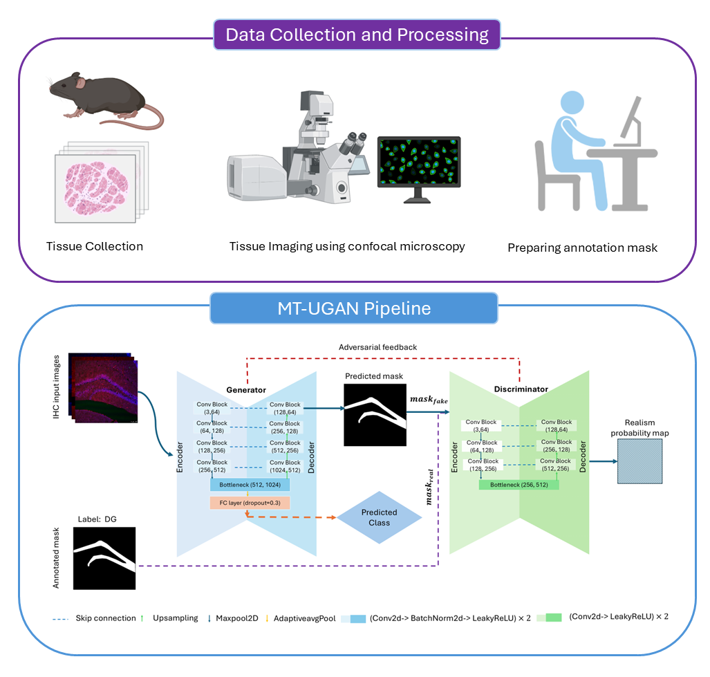

# MT-UGAN
This repository contains the complete MT-UGAN pipeline and a link to the dataset presented in the paper "Segmentation and Classification of Hippocampal Subregions using Multi-Task Generative Adversarial Networks."

# Abstract
Accurate segmentation and identification of hippocampal subregions are essential for understanding spatial memory, neuronal plasticity, and disease-related alterations in brain architecture. While fluorescent immunohistochemistry (IHC) enables detailed visualization of subregion-specific molecular markers, automated segmentation and classification remain challenging due to staining variability, morphological complexity, and low signal-to-noise ratios. Moreover, the absence of benchmark datasets has hindered the development of computational approaches for the automatic segmentation and identification of hippocampal regions in histological images, which are crucial for streamlining downstream analyses. To address these limitations, we introduce a novel multiplexed hippocampal dataset containing images stained with cFos, NeuN, and either ΔFosB or GAD67, capturing neuronal activity, structural features, and plasticity-associated signals. In parallel, we propose a multitask UNet-based generative adversarial network (MT-UGAN) that simultaneously performs segmentation and classification of hippocampal subregions from murine IHC images. The model leverages a UNet-based GAN architecture with a shared encoder, allowing for feature reuse across both segmentation and classification tasks. Together, the dataset and MT-UGAN establish the first integrated system for automated hippocampal subregion analysis. Experimental results demonstrate that the proposed MT-UGAN significantly outperforms conventional single-task models in both region-wise segmentation and classification performance, achieving a Dice score of 0.82 and classification accuracy of 91.0%. By unifying subregion segmentation and identification, this framework provides a scalable and interpretable solution for automated hippocampal analysis, thereby facilitating downstream analyses in neuroimaging research.

### Dataset
The dataset introduced in his study can be downloaded [here!](https://rutgers.box.com/v/HippocampalROISegDataset).
"""
